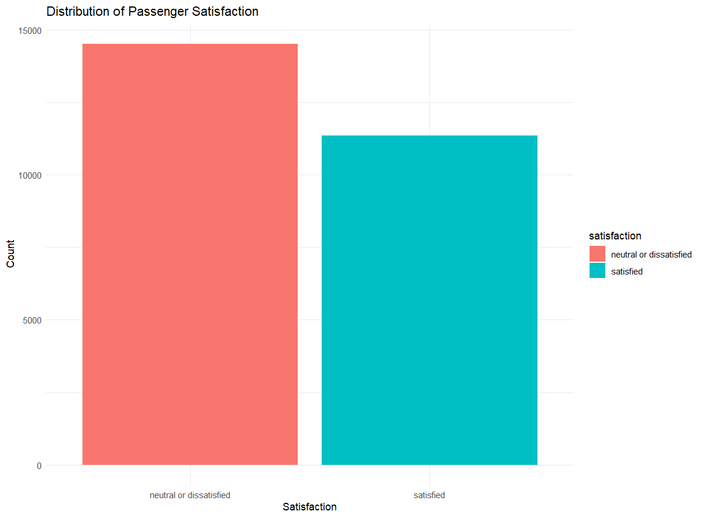
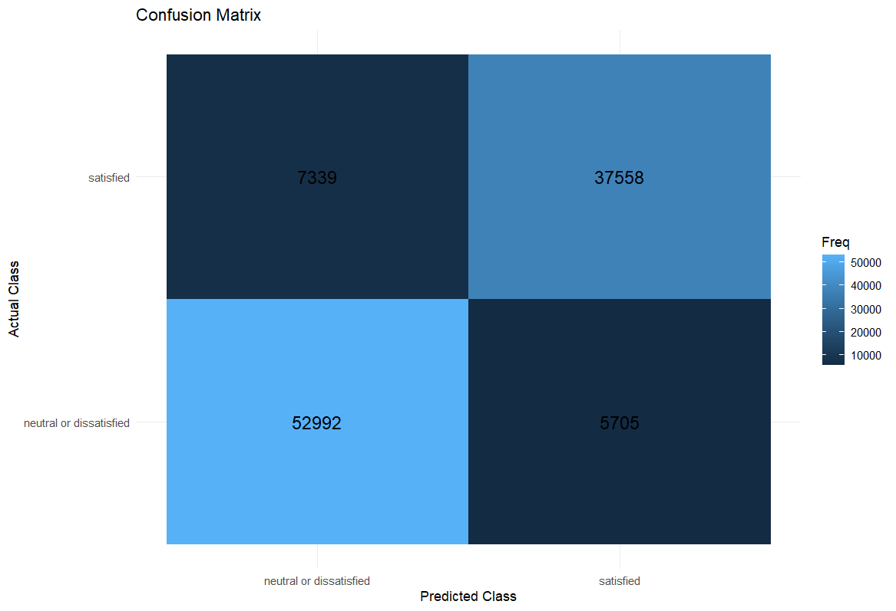
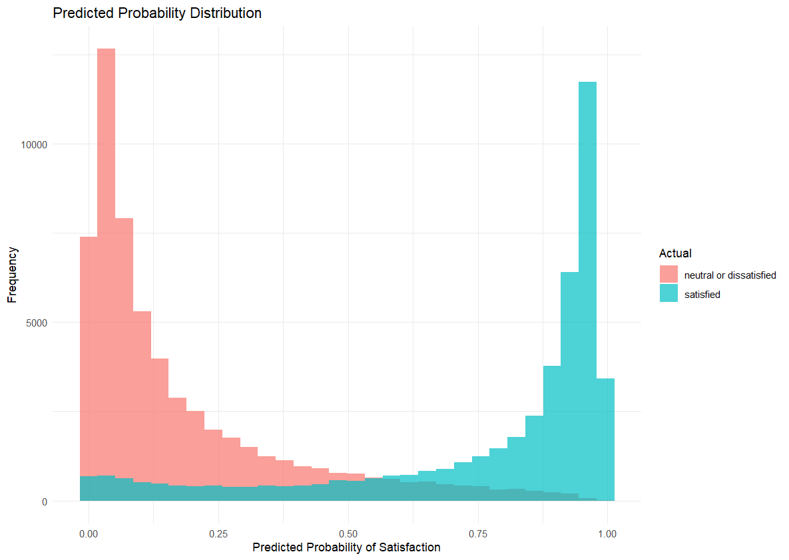
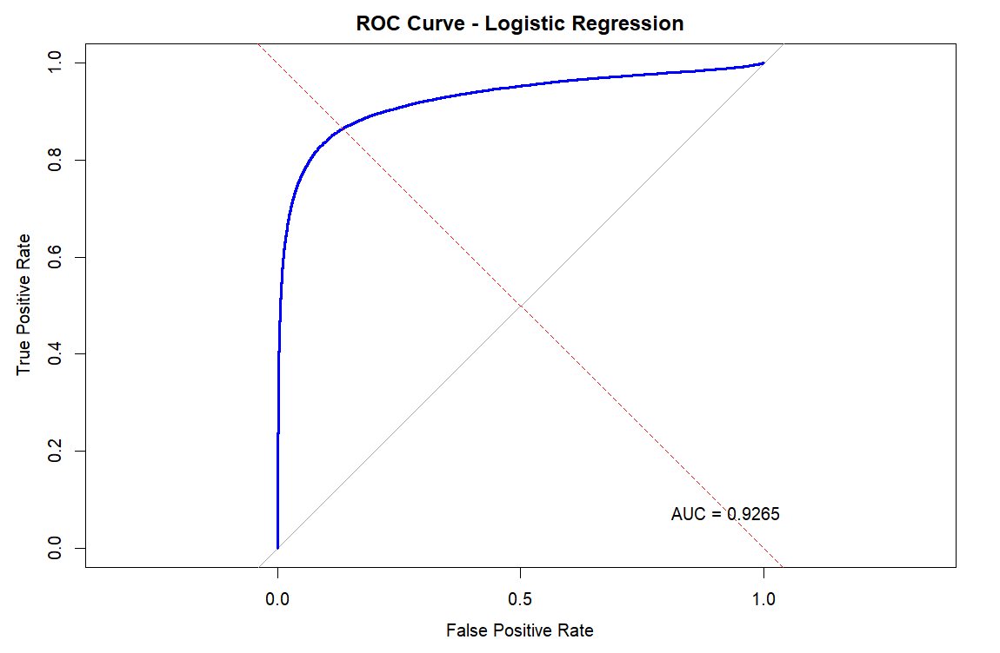
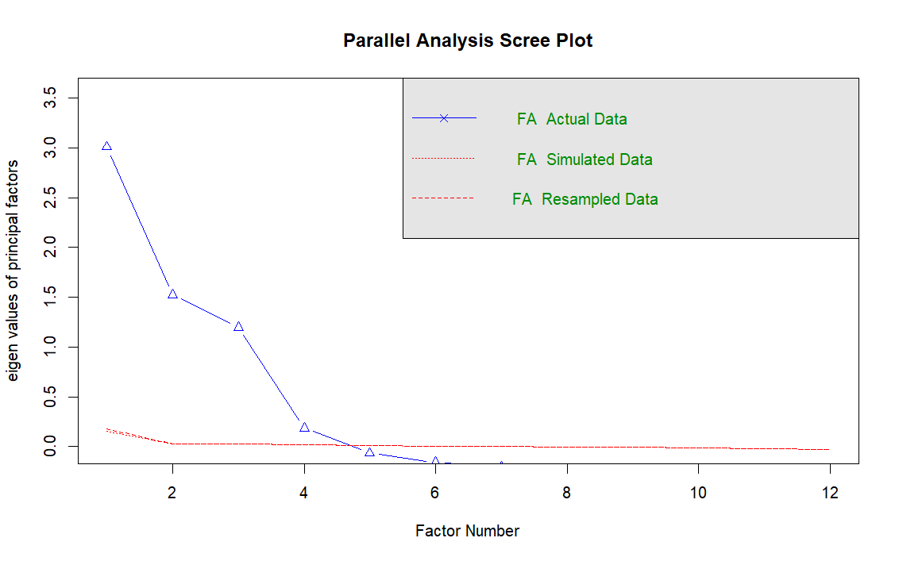
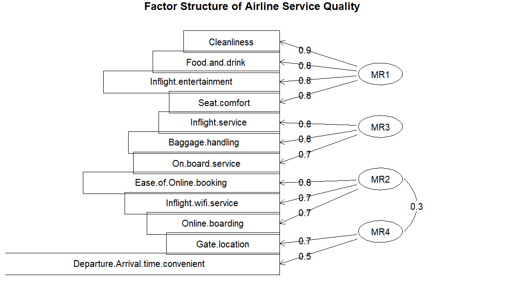
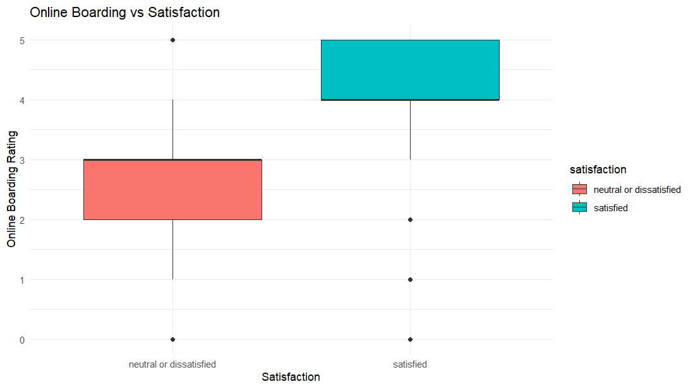

# ✈️ Airline Passenger Satisfaction Analysis using Machine Learning & Factor Analysis

### 📊 Data-Driven Insights into Customer Satisfaction in the Aviation Industry

### 🚀 Predicting Passenger Satisfaction & Uncovering Key Service Quality Dimensions

---

# 📖 Project Overview

Passenger satisfaction plays a crucial role in airline success, influencing customer retention, brand loyalty, and overall business performance. This project leverages **Machine Learning**, **Statistical Modeling**, and **Factor Analysis** to identify the key factors affecting passenger satisfaction and predict customer sentiment based on service quality metrics.

The analysis combines **Logistic Regression** for predictive modeling and **Factor Analysis** for uncovering hidden service quality dimensions, providing actionable insights that can support data-driven decision-making within the aviation industry.

---

# 🎯 Objectives

✅ Predict passenger satisfaction using Machine Learning

✅ Evaluate model performance using classification metrics

✅ Identify the most influential drivers of satisfaction

✅ Discover hidden service quality dimensions

✅ Generate business-focused insights for service improvement

✅ Demonstrate practical applications of predictive analytics in aviation

---

# 📂 Dataset Information

The dataset contains information about airline passengers, including:

- 👤 Passenger Demographics
- ✈️ Travel Type
- 🎫 Flight Class
- 🌐 Online Services
- 💺 Seat Comfort
- 🎬 Inflight Entertainment
- 🍽️ Food & Drink
- 🧹 Cleanliness
- 🧳 Baggage Handling
- 🛎️ Inflight Service
- ⏱️ Flight Delays

### 🎯 Target Variable

Passenger Satisfaction:

- 😊 Satisfied
- 😐 Neutral or Dissatisfied

---

# 📊 Exploratory Data Analysis

## Passenger Satisfaction Distribution

The dataset contains a slightly higher proportion of **Neutral or Dissatisfied** passengers compared to **Satisfied** passengers. This indicates that while many travelers report positive experiences, there remains substantial scope for service improvement.

Understanding this distribution is important because it provides an initial view of overall customer sentiment and establishes the foundation for predictive modeling.

---

# 🤖 Logistic Regression Model

To predict passenger satisfaction, a **Logistic Regression** model was developed using all available passenger demographics, travel details, and service quality ratings.

The model estimates the probability that a passenger belongs to the satisfied category and helps identify the factors that most strongly influence customer experience.

---

# 📈 Model Performance Summary

| Metric | Value |
|----------|----------|
| Accuracy | **87.17%** |
| Sensitivity | **90.20%** |
| Specificity | **83.30%** |
| Balanced Accuracy | **86.75%** |
| AUC Score | **0.9255** |

### 🔍 Analysis

The model achieved an impressive **87.17% Accuracy**, correctly classifying nearly 9 out of every 10 passengers.

The high **Sensitivity (90.20%)** demonstrates excellent identification of dissatisfied passengers, while the strong **Specificity (83.30%)** reflects reliable detection of satisfied customers.

An **AUC score of 0.9255** indicates outstanding classification capability and confirms the model's ability to distinguish between satisfaction categories with high confidence.

---

# 🔥 Confusion Matrix

The confusion matrix provides a visual representation of prediction performance.

Most observations fall along the diagonal, indicating that the majority of passengers were correctly classified. The relatively small number of misclassifications demonstrates the effectiveness of the Logistic Regression model in predicting customer satisfaction.

---

# 🎯 Predicted Probability Distribution

This distribution shows the confidence level of the model's predictions.

Most probability values are concentrated near 0 or 1, indicating that the model makes highly confident predictions for the majority of passengers. Only a small portion of observations fall near the decision boundary, suggesting minimal classification uncertainty.

This is a strong indicator of model reliability and robustness.

---

# 📉 ROC Curve Analysis

### 🏆 Key Result

**AUC = 0.9255**

The ROC Curve remains close to the upper-left corner of the graph, demonstrating exceptional classification performance.

### 💡 Why It Matters

A model with an AUC greater than 0.90 is generally considered excellent in predictive analytics. This result confirms that passenger satisfaction can be predicted accurately using service quality and travel-related attributes.

---

# 🔑 Key Drivers of Passenger Satisfaction

The Logistic Regression model revealed several variables with significant influence on satisfaction outcomes.

### 🚀 Positive Drivers

- Customer Loyalty
- Online Boarding
- Cleanliness
- Inflight Service
- On-board Service
- Seat Comfort
- Baggage Handling
- Inflight Entertainment

### ⚠️ Negative Drivers

- Personal Travel
- Economy Class Travel
- Economy Plus Travel

### 📌 Key Insight

The results indicate that service quality factors influence passenger satisfaction more strongly than demographic characteristics, highlighting the importance of customer experience management.

---

# 🧠 Factor Analysis

While Logistic Regression identifies important variables individually, Factor Analysis helps reveal broader service quality dimensions hidden within the data.

### Statistical Validation

**KMO Score:** `0.77`

**Bartlett's Test:** `p < 0.001`

These results confirm that the dataset is suitable for extracting meaningful latent factors.

---

# 📉 Scree Plot

The Scree Plot was used to determine the optimal number of factors to retain.

A clear elbow is observed after the fourth factor, indicating that additional factors contribute limited explanatory value. Based on this result, four major factors were retained for further interpretation.

---

# 📊 Factor Structure of Airline Service Quality

The Factor Analysis grouped service-related variables into four major dimensions:

### ✈️ Cabin Experience

- Seat Comfort
- Food & Drink
- Inflight Entertainment
- Cleanliness

### 💻 Digital Experience

- WiFi Service
- Online Booking
- Online Boarding

### 🛎️ Operational Service Quality

- Inflight Service
- On-board Service
- Baggage Handling

### 🏢 Airport Convenience

- Gate Location
- Arrival & Departure Convenience

These four factors collectively explain approximately **60.2% of the variance** in service quality ratings.

---

# 📱 Online Boarding vs Satisfaction

Among all service attributes, **Online Boarding** emerged as one of the strongest predictors of passenger satisfaction.

Passengers who reported higher online boarding ratings were substantially more likely to be satisfied, emphasizing the growing importance of digital experiences within modern airline operations.

---

# 🌍 Real-World Applications

### ✈️ Customer Experience Management

Identify service areas requiring improvement and prioritize customer-focused initiatives.

### 📈 Customer Retention

Predict dissatisfaction early and implement targeted retention strategies.

### 🎯 Service Quality Optimization

Focus resources on the service dimensions that generate the greatest impact on satisfaction.

### 💰 Resource Allocation

Support investment decisions using data-driven evidence.

### 📊 Performance Monitoring

Continuously monitor customer sentiment and service effectiveness.

### 🏢 Strategic Decision Making

Provide actionable insights for management, operations teams, and customer experience departments.

---

# 🏆 Key Findings

- ✅ Logistic Regression achieved **87.17% Accuracy**
- ✅ Model achieved **0.9255 AUC Score**
- ✅ Customer Loyalty is a major satisfaction driver
- ✅ Online Boarding significantly impacts customer experience
- ✅ Service quality variables outperform demographic variables in predictive power
- ✅ Four major service dimensions were identified
- ✅ Factor Analysis explained **60.2% of total variance**
- ✅ Digital services and operational efficiency strongly influence satisfaction

---

# 📌 Final Interpretation

This analysis demonstrates that airline passenger satisfaction is primarily driven by the quality of services delivered throughout the customer journey. While demographic characteristics contribute to customer perception, operational excellence, digital services, cabin comfort, and service quality have a substantially greater impact on satisfaction outcomes.

The Logistic Regression model achieved excellent predictive performance, while Factor Analysis successfully reduced numerous service variables into four meaningful service dimensions. Together, these techniques provide a comprehensive understanding of customer behavior and highlight opportunities for improving passenger experiences.

Organizations can leverage these insights to enhance service quality, strengthen customer loyalty, reduce dissatisfaction, and make informed strategic decisions that ultimately improve overall business performance.

---

# 🛠️ Technologies Used

- R Programming
- Logistic Regression
- Factor Analysis
- KMO Test
- Bartlett's Test
- ROC & AUC Analysis
- caret
- psych
- pROC
- ggplot2

---

